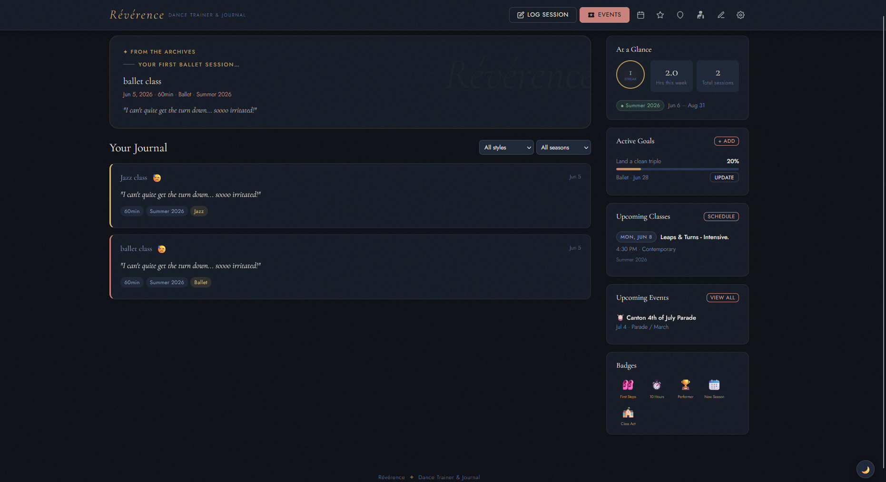

# Révérence — Dance Trainer & Journal

A personal dance journal and training tracker for dancers of all styles and levels. Log practice sessions, track skills, record goals, plan seasons and classes, and log events — competitions, recitals, parades, holiday performances, and more. Built for the dancer, not the studio.

#### Demo:
https://badbox29.github.io/reverence/

---

#### Screenshot


---

## Features

- **Journal feed** — log practice sessions with style, duration, mood, notes, and media links; voice-first card design surfaces your own words front and center
- **From the Archives** — a daily spotlight that surfaces a past entry with temporal framing ("One year ago today…", "Just before Spring Recital · 2025…"), your own quoted words, and a skills growth callout
- **Skills tracker** — star-rate individual techniques across all 6 styles (Ballet, Contemporary, Lyrical, Jazz, Tap, Hip-Hop) with timestamped history for growth tracking over time
- **Events log** — log competitions, recitals, parades, holiday performances, workshops, and more; each event type has its own relevant fields (placement, costume, judge feedback, instructor, etc.) plus a journal notes section
- **Season & class scheduler** — create seasons with date ranges, build weekly class schedules within seasons, tag classes to journal entries; archive seasons (reversible) to keep history without clutter
- **Intensives support** — classes can be typed as Intensive with preset durations (3-day, 5-day, 1-week, 2-week, summer) or custom start/end dates
- **Goal tracking** — set style-specific goals with target dates and progress sliders; completed goals are timestamped for Year in Review stats
- **Upcoming classes widget** — sidebar shows today's classes, tomorrow's classes, or the next class day within 7 days
- **Upcoming events widget** — sidebar shows the next 4 events within 90 days
- **Pointe tracker** — dedicated section (optional) with readiness checklist, conditioning tracker, and pointe shoe fitting log (brand, size, vamp, shank)
- **Injury log** — log and track injuries with body area, description, treatment notes, and status (Active / Recovering / Healed); cycle status with one tap
- **35 badges** — earned-only display across 8 categories: practice milestones, streaks, goals, skills, events, seasons, pointe, and fun/surprise
- **Year in Review** — auto-generated annual summary with stats, timeline, skills growth (before/after star ratings), best journal excerpts, and active goals; defaults to prior year with dropdown to visit any year
- **Your Story So Far** — full career arc with lifetime stats, first session, year-by-year summary, new styles timeline, skills portrait, best excerpts, and all earned badges
- **Cross-device sync** — KV sync via Cloudflare Worker; lastModified timestamp conflict resolution; offline resilience with dirty-flag queuing and 60-second reconnect pings
- **Hybrid authentication** — three account types: Guest (local only), Token (secure 128-bit generated credential), and Google OAuth; each with its own onboarding path
- **Account setup wizard** — guided multi-screen onboarding: load an existing account (via token or Google sign-in) or start fresh (token or Google); guest mode lets new users explore without committing
- **Token → Google upgrade** — one-way, permanent migration from token auth to Google sign-in; server-side atomic copy with 90-day legacy forwarding so other devices self-migrate on next sync
- **Automatic token migration** — legacy tokens (pre-v0.6) are detected at boot and upgraded to 128-bit cryptographic tokens; secondary devices auto-migrate silently via worker forwarding pointer
- **Switch Account** — load a different user's data by token from Settings
- **Dark / light mode** — full theme toggle
- **Mobile responsive** — two-column layout collapses to single column; header icons collapse to icon-only on narrow screens; modals slide up from bottom on mobile

---

## File Structure

```
reverence/
├── index.html          # App entry point
├── css/
│   └── style.css       # All styles
├── js/
│   └── app.js          # All client-side logic
├── worker.js           # Cloudflare Worker (deploy separately)
└── README.md
```

---

## Setup

### 1. Get the files

Clone or download this repository. The app is entirely static — `index.html`, `css/style.css`, and `js/app.js` are all you need to run it locally.

Open `index.html` directly in a browser, or host it on GitHub Pages (or any static host) for a permanent URL.

---

### 2. Deploy the Cloudflare Worker

The Worker provides KV storage for cross-device sync and handles authentication. A free Cloudflare account is sufficient for personal use.

#### 2a. Create the Worker

1. Log in to [dash.cloudflare.com](https://dash.cloudflare.com) and open **Workers & Pages**.
2. Click **Create** → **Create Worker**.
3. Give it a name (e.g. `reverence-worker`) and click **Deploy**.
4. Click **Edit code**, paste the entire contents of `worker.js`, and click **Deploy** again.
5. Note your worker URL — it will look like `https://reverence-worker.your-subdomain.workers.dev`.

#### 2b. Create and bind a KV namespace

1. In the Cloudflare dashboard, go to **Workers & Pages → KV**.
2. Click **Create a namespace**, name it `REVERENCE_KV`, and click **Add**.
3. Go back to your Worker → **Settings → Bindings**.
4. Click **Add** → **KV Namespace**.
5. Set the **Variable name** to exactly `REVERENCE_KV` and select the namespace you just created.
6. Click **Deploy** to save the binding.

> **Why `REVERENCE_KV`?** The worker references `env.REVERENCE_KV` by that exact name. A different variable name will cause all storage operations to fail with a 500 error.

#### 2c. Configure the origin allowlist

The Worker only accepts requests from trusted origins. Open `worker.js` and update the `ALLOWED_ORIGINS` array at the top of the file with your deployed URLs before deploying:

```js
const ALLOWED_ORIGINS = [
  'https://yourusername.github.io',
  // add additional domains here if needed
];
```

#### 2d. (Optional) Configure Google OAuth

To enable Google sign-in, create an OAuth Client ID in [Google Cloud Console](https://console.cloud.google.com):

1. Create or open a project → **APIs & Services → Credentials → Create OAuth Client ID**.
2. Application type: **Web application**. Add your domain(s) to Authorised JavaScript origins.
3. Set the scopes to `openid`, `email`, and `profile` on the OAuth consent screen.
4. Copy the Client ID (looks like `123456789.apps.googleusercontent.com`).
5. Set `GOOGLE_CLIENT_ID` to this value in both `js/app.js` and `worker.js`.

Without a Client ID, Google sign-in buttons are hidden and the app operates in token-only mode.

#### 2e. Point the app at your Worker

1. Open the app and complete the account setup wizard.
2. Enter your Worker URL when prompted — the app tests the connection before proceeding.

---

### 3. Account Types & Onboarding

Révérence supports three account types. New users are prompted to choose on first load.

#### Guest mode
No setup required. Data is saved locally in the browser only — nothing syncs to the Worker. Guests can explore the full app and convert to a real account at any time from Settings, keeping all their existing data.

#### Token accounts
A 128-bit cryptographically secure token is generated automatically and stored locally. The token is your identity and your credential — keep it private. Token accounts sync across devices via the Cloudflare Worker.

- **New device**: open Settings → enter your Worker URL and token to load your account.
- **Token upgrade**: accounts created before v0.6 use a legacy token format. The app detects this at boot and offers a one-click upgrade. Secondary devices upgrade automatically on their next sync — no manual action needed.

#### Google accounts
Sign in with your Google account for stronger security and easier access. Google accounts use your stable Google identity (`sub` claim) as the KV key — no token to manage.

- **Upgrade from token**: Settings → **Upgrade to Google Sign-In**. This is a permanent one-way migration. Your token stops working after migration; other devices are notified via a server-side tombstone.

---

### 4. Cross-Device Sync

Data syncs automatically on every save through your Cloudflare Worker. If the Worker is unreachable, changes are queued locally and pushed when connectivity is restored (checked every 60 seconds).

Conflict resolution: if both devices have data, the one with the more recent `lastModified` timestamp wins. If timestamps are equal (or the Worker has no data yet), local data is pushed up.

Token accounts can switch users on the same device via Settings → **Switch Account**.

---

## Security

The Worker enforces several layers of protection:

- **Origin allowlist** — requests from unlisted origins (including direct API calls with no `Origin` header) are rejected with 403.
- **Rate limiting** — GET requests are limited to 60 per IP per hour, tracked in KV. Exceeding the limit returns 429 with `Retry-After` headers.
- **Token validation** — tokens must be 8–128 characters of base64url-safe characters. Legacy short tokens are accepted for backwards compatibility.
- **Google JWT verification** — for Google accounts, the Worker fetches Google's public JWKS and verifies the RS256 signature, audience, issuer, and expiry on every auth request.
- **Legacy forwarding** — migrated tokens leave a server-side pointer for 90 days so remaining devices can self-migrate; migrated-to-Google tombstones persist for 90 days and return 410 to stale clients.

---

## Styles Supported

Ballet · Contemporary · Lyrical · Jazz · Tap · Hip-Hop

---

## Event Types

| Type | Fields |
|---|---|
| Competition | Style, piece, placement, score, costume, music, judge feedback |
| Recital | Pieces performed, style(s), role/part, costume |
| Parade / March | Formation/group, duration, weather, route/distance |
| Holiday Performance | Role/character, piece(s), costume, number of performances |
| Workshop / Masterclass | Instructor, host/organization, style focus, key takeaways |
| Other | Role, additional details |

All event types include: event name, date, venue/location, media link, and journal notes.

---

## Worker Routes

| Method | Route | Description |
|---|---|---|
| `GET` | `/` | Health check |
| `OPTIONS` | `/*` | CORS preflight |
| `GET` | `/kv/:token` | Fetch data for a token or Google KV key |
| `PUT` | `/kv/:token` | Save data (JSON body, max 5 MB); writes legacy forwarding pointer if `_legacyToken` present |
| `POST` | `/auth/google` | Verify Google ID token; return KV key derived from `sub` claim |
| `POST` | `/auth/verify` | Re-verify a stored Google credential |
| `POST` | `/auth/migrate` | One-way token → Google migration; atomic server-side copy + tombstone |

---

## Data & Privacy

All data is stored in Cloudflare KV under your account key. Nothing is stored server-side beyond what you explicitly save. No analytics, no ads, no third-party data sharing.

`localStorage` is used as a local cache and sync fallback when the Worker is unreachable. KV is the source of truth when both are present and timestamps differ.

For token accounts, your token is both your identity and your credential — keep it private. For Google accounts, authentication is handled by Google's identity platform; Révérence stores only the verified profile fields (`sub`, `email`, `name`, `picture`) returned by Google's public keys.

---

## Version

**v0.6** — Hybrid authentication (Guest / Token / Google OAuth), secure token generation, Worker security hardening (origin allowlist, rate limiting, JWT verification), multi-screen onboarding wizard, token → Google upgrade path, automatic legacy token migration
